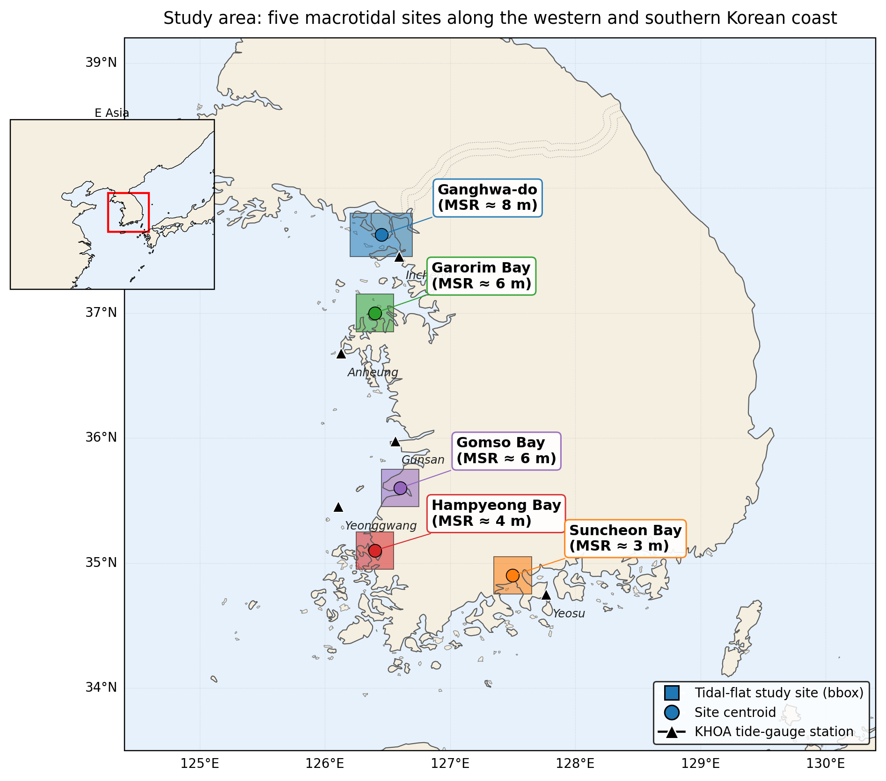
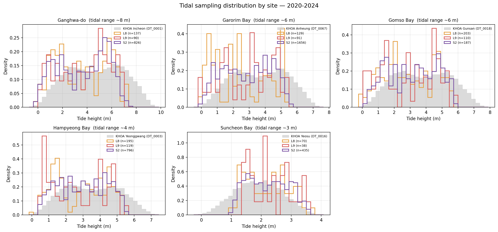
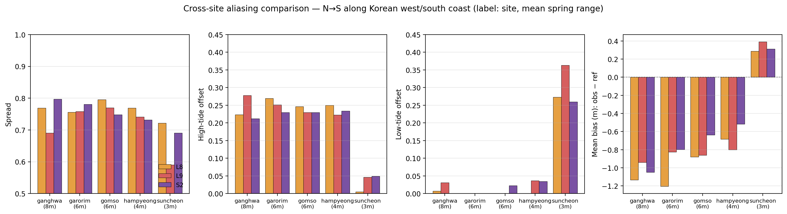
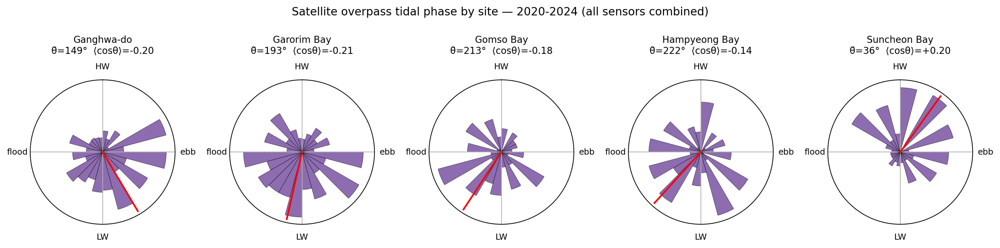
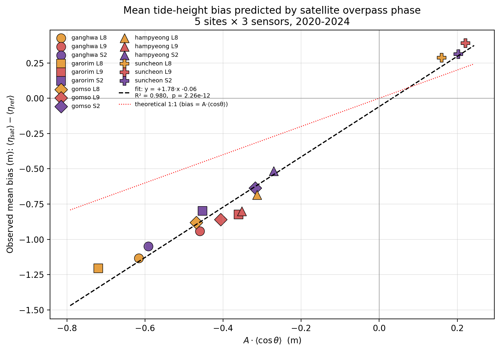
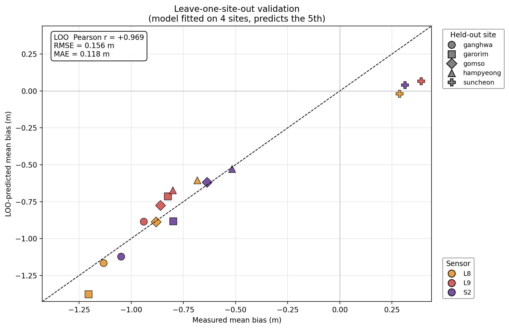

> **국문 번역본 안내.** 본 문서는 영문 원고 `draft.md`의 충실한 국문 번역본입니다.
> 수식, 그림, 표 일련번호와 참고문헌(BibTeX 항목명) 체계는 영문본과 동일하며,
> 본문만 한국어로 옮겨져 있습니다. 학술지 투고용은 영문본이며 본 국문본은
> 국내 공유·발표·심사 보조 목적으로 작성되었습니다.

## 핵심 요지(Highlights)

- 폐쇄형 모델 $\text{bias} = \beta \cdot A \cdot \langle\cos\theta\rangle$ 이 사이트·센서 분산의 98 %를 설명한다.
- 한반도 amphidromic 위상 경사대를 횡단할 때 조위 편향의 *부호* 가 반전한다.
- $\beta > 1$ 은 사리–조금 × 통과 위상의 공분산항으로 분해되는 *물리적 진단량* 이다.
- 전 지구 조석 모델 **FES2022b** 만으로 적합이 재현되며, 현지 조위계 자료가 필요하지 않다.
- 표고 영역 RMSE 0.4–1.1 m, 영구 미관측 조간대 폭 최대 2.5 km로 환산된다.

---

## 1. 서론

### 1.1 동기

전 세계 조간대는 약 128,000 km$^{2}$로 추정되며(Murray et al., 2019; Worm et al., 2006), 탄소 격리, 어류·갑각류 서식지 제공, 해안 폭풍 완충 등 핵심 생태계 서비스를 담당한다. 그러나 이들 지역에 대한 디지털 표고 모델(DEM)은 현장 측량 비용과 접근성 제약으로 인해 대규모 일관 매핑이 어렵다. 항공 LiDAR가 가장 정확한 자료를 제공하지만 비용이 크고, 임무 단위로 단발적으로 운영된다. 위성 탑재 ICESat-2 레이저 고도계는 최근 조간대에서 반복 가능한 cm급 직접 표고 기준을 제공하지만, 성기고 불연속적인 지상 트랙으로 인해 단독 DEM 밀도는 제한적이다(Xu et al., 2022).

가장 널리 사용되는 위성 기반 대안은 **워터라인 기법**(Mason et al., 1995; Heygster et al., 2010; Murray et al., 2012)이다. 단순한 형태로는, 위성 통과 시각 $t$에 취득된 무운(無雲) 영상마다 정의되는 해륙 경계선이 곧 등표고 등고선 $z = \eta(t)$이며, 여기서 $\eta$는 인접 조위관측소 기준 datum 조위이다. 서로 다른 조위 단계의 위성 영상에서 추출된 다수의 워터라인을 중첩하면 조간대 hypsometric 곡선을 이산화할 수 있고 이를 보간해 DEM을 만든다. 이 접근은 Digital Earth Australia Intertidal 산물(Sagar et al., 2017; Bishop-Taylor et al., 2019a, 2019b)의 기반이며 전 세계적으로 빠르게 확산되고 있다(Tseng et al., 2017; Khan et al., 2019; Salameh et al., 2019; Wang et al., 2020). 이를 보완하는 흐름으로, ICESat-2 레이저 고도계를 광학·SAR 워터라인과 결합해 수직 기준을 직접 구속하는 연구가 있다(Zhang et al., 2022; Xin et al., 2025).

### 1.2 미해결 문제: 태양동기 표본화 편향

태양동기 궤도는 거의 모든 주요 광학 관측위성을 거의 고정된 *국지 태양시*(local solar time, LST)에 배치한다. Landsat-8/9 및 Sentinel-2 임무 모두 적도를 LST $\approx$ 10:00–10:30에 하강 횡단하며, 연간 수 분 수준으로만 표류한다. 우세 분조인 $M_{2}$ 조의 주기는 12.42 h이므로 위성 영상은 태양일과 *비공약수* 간격으로 조석을 표본화한다. 즉 동일 사이트에서 연이은 통과가 조금씩 다른 조석 위상을 잡지만, 그 위상은 좁은 시간대 창에 갇힌다. Bishop-Taylor et al. (2019a)는 Digital Earth Australia Intertidal 산물에서 이로 인한 *조석 별칭(tidal aliasing)*을 spread 및 저조·고조 offset 지표로 처음 정량화하여, 위성 표본 조위 분포가 기저 조석 사이클 대비 0이 아닌 평균 편향과 절단된 조차를 갖는다는 점을 보였고, 오픈소스 eo-tides 패키지(Bishop-Taylor et al., 2025)는 이 진단을 전 지구 규모에서 접근 가능하게 했다. Sent et al. (2025)는 포르투갈 대조차 Tagus 강 하구에서 Sentinel-2 탁도 자료가 대조 시 저조에 과대 표본화, 소조 시 고조에 과소 표본화되는 유사한 광학 센서 별칭을 보고하였다. 이러한 인식에도 불구하고 위성 통과 시각의 국지 조석 위상으로부터 편향 진폭을 예측 가능하게 연결하는 폐형 *사전적* 모델은 아직 제안되지 않았다.

한국 사례에서는 본 현상의 *고도계 영역* 대응 현상이 Lee, K. et al. (2022)에 의해 보고되었다. 그들은 인천 부근의 조석 보정 위성 고도계 해수면 이상이 1990년대 초에는 저조 시각, 2013–2017년에는 고조 시각에 우선 표본화되어 보정 이전 다중 임무 해수면 상승 추세를 최대 약 30 mm $\cdot$ yr$^{-1}$ 과대 평가함을 보였다. 그러나 그 연구는 단일 고도계 풋프린트 안에서의 표본화 위상의 *시간적* 표류를 다루며, 본 연구는 광학 워터라인 워크플로의 *공간적* 대응 현상을 다룬다.

운영 차원에서도 같은 절단 현상이 경험적으로 인지되어 있다. 최근 한국 서해안의 다중 센서 워터라인 DEM 연구는 Landsat-8/9 및 Sentinel-2가 상부 조간대를, Sentinel-1 SAR이 하부 조간대를 시스템적으로 누락하며, 광학+SAR 혼합 관측이 최소 다개월 수집 기간을 거친 뒤에야 안정적 DEM에 수렴함을 보고한 바 있다(Lee, J. et al., 2025). 그러나 그 경험적 임계가 *왜* 그 시점에 형성되는지, 그리고 센서별 절단 방향의 비대칭이 *왜* 발생하는지에 대한 1차 원리 유도는 이루어지지 않았다.

다음 세 가지 미해결 질문이 남는다:

1. **본 편향은 시스템적으로 예측 가능한가, 아니면 잡음적·우발적인가?**
2. **이 편향은 지역 무조점 구배에 따라 어떻게 변하는가?**
3. **조위 편향이 DEM 표고 영역으로 실제로 어떻게 환산되며, 어느 규모에서 문제가 되는가?**

표 1은 한국 조간대 DEM 및 표본화 편향 문헌 안에서 본 연구의 위치를 정리한 것이다.

\begin{table}[!htbp]
\centering
\footnotesize
\caption{\textbf{한국 조간대 DEM 및 고도계 표본화 문헌 안에서 본 연구의 위치.} 본 연구는 광학 워터라인 표본화 편향을 \textit{해석적·사전적}으로 처음 다루며, 기존 한국 연구는 단일 사이트 DEM 매핑, 경험적 편향 처리, 또는 고도계(해수면) 영역에 국한된다.}
\label{tab:positioning}
\renewcommand{\arraystretch}{1.15}
\begin{tabular}{@{}>{\raggedright\arraybackslash}p{2.6cm}>{\raggedright\arraybackslash}p{2.2cm}>{\raggedright\arraybackslash}p{2.0cm}>{\raggedright\arraybackslash}p{2.6cm}>{\raggedright\arraybackslash}p{2.4cm}>{\raggedright\arraybackslash}p{2.6cm}@{}}
\toprule
\textbf{연구} & \textbf{지역} & \textbf{센서} & \textbf{방법} & \textbf{산출물} & \textbf{표본화 편향 처리} \\
\midrule
Ryu et al. (2002) & 곰소만(서) & Landsat-TM & 단일 장면 워터라인 & 단일 시기 등고선 & 미처리 \\
Lee \& Ryu (2017) & 강화도(북서) & TanDEM-X (SAR InSAR) & 위상 기반 DEM & 단일 임무 DEM & 센서 단위만 \\
Yun et al. (2022) & 강화도(북서) & TanDEM-X & InSAR 위상, 공공 서비스 & 고해상도 DEM 산물 & 미처리 \\
Lee, K. et al. (2022) & 인천 광역 & 다중 임무 고도계(T/P–Jason, Cryosat) & 다중 임무 조석 보정 추세 & 해수면 상승률 & 고도계 영역 \textit{시간적} 위상 편향 \\
Lee, J. et al. (2025, ECSS) & 태안반도(서) & L8/9 + S2A/B + S1A & 다중 센서 워터라인 융합 & 5개월 최적 DEM(UAV-LiDAR 대비 MAE 25.6 cm) & 광학+SAR 융합 \textit{경험적} 최적화 \\
\textbf{본 연구} & \textbf{서·남해, 5개 사이트(2020–2024)} & \textbf{L8/9 + S2(메타데이터; 5,082 장)} & \textbf{위상 편향 해석; $\beta \cdot A \cdot \langle \cos\theta\rangle$} & \textbf{\textit{사전적} 편향 보정 모델 + DEM 오차 예산} & \textbf{해석적 예측, 사이트·센서에 대해 $R^{2} = 0.98$} \\
\bottomrule
\end{tabular}
\end{table}

### 1.4 한국 대조차 환경

한국 서해안에는 동아시아 최대 규모에 해당하는 약 2,500 km$^{2}$의 조간대가 분포한다(Koh and Khim, 2014; Murray et al., 2014). 인천의 평균 대조차가 8 m를 초과하는 등 세계적으로도 큰 조차 환경 아래에 있으며, 남해안(여수·순천만)에서는 지역 무조점 구조로 인해(진폭이 거의 0인 절점을 중심으로 조석 위상이 회전하는 지역 패턴) 조차가 약 3 m로 감소한다. 한반도 북서단과 남단 사이의 고조 위상 차이는 약 4 h에 달한다(Choi et al., 2014). 큰 진폭, 강한 지역 구배, 잘 정비된 조위관측망의 조합은 한국을 위성 조석 표본화 편향의 *정량화* 및 *예측*을 위한 이상적 자연 실험실로 만든다.

### 1.5 본 연구의 기여

본 논문은 한국에서 진행되어 온 경험적 워터라인 최적화 연구 흐름(Ryu et al., 2002, 2008; Lee and Ryu, 2017; Yun et al., 2022; Lee, J. et al., 2025)과 전 세계 연구(Bishop-Taylor et al., 2019a, b; Sagar et al., 2017; Murray et al., 2019; Salameh et al., 2019)에 대한 *이론적 보완*으로 자리매김한다. 구체적으로 다음과 같은 단대단(end-to-end) 분석을 제시한다:

(i) 1-매개변수 해석 모델 $\text{mean bias} = \beta \cdot A \cdot \langle \cos\theta\rangle$를 도입한다. 이는 위성 표본 조위 편향을 국지 조석 진폭 $A$와 통과 위상의 평균 코사인 $\langle \cos\theta\rangle$에 연결하며, 우리가 아는 한 광학 워터라인 워크플로에 대한 최초의 폐형 *사전(a priori)* 편향 예측 식이다(결론 1–2).

(ii) 이 모델이 사이트·센서 분산의 98 %를 설명하고 외부 사이트에 대해 RMSE = 0.16 m로 일반화함을 보이며, 기울기 초과($\beta = 1.78 \neq 1$)가 spring–neap × $\cos\theta$ 공분산 항으로 **정량적으로 분해**됨을 입증한다. 따라서 $\beta > 1$은 경험적 보정 계수가 아니라 *물리적 진단*에 해당한다(결론 2).

(iii) 편향의 부호가 무조점 위상 구배를 가로질러 *반전*함을 정량적으로 처음 시연한다. 이는 Lee, K. et al. (2022)이 인천 부근에서 보고한 시간적 고도계 표본화 편향의 공간 영역 대응 현상이다(결론 3).

(iv) 조위 편향을 분위수 매핑으로 표고 영역의 DEM 오차로 환산하여, 영구 미표본 조간대 띠(최대 2.5 km 폭)의 정량 추정치를 처음 제공하고, 경험적으로 관찰되는 다중 센서 데이터 수집 창 최적치가 중간 시간 척도에서 포화되는 이유에 대한 1차 원리 설명을 제공한다(§5.3; 결론 4–6).

(v) 독립적인 전 지구 해양 조석 모델(FES2022b: 보류 15점 전체에서 편향 부호 일치, $R^{2} = 0.983$)로부터도 적합이 재현됨을 보임으로써, 본 *사전(a priori)* 보정이 현지 조위계 자료 없이도 전 세계적으로 적용 가능함을 확인하였다(결론 7).

---

## 2. 연구 지역 및 자료

### 2.1 사이트

한반도 서해안 전체와 남해안 일부를 아우르며 국지 조차와 지역 위상 차이의 전체 범위를 포괄하기 위해 다섯 개 조간대를 선정하였다(그림 1; 표 2):

- **강화도** (MSR $\approx$ 8 m): 한국에서 가장 큰 단일 조간대 복합지로, 조석 사이클의 약 50 % 동안 노출된다.
- **가로림만** (MSR $\approx$ 6 m): 반폐쇄 만으로 조간대가 가장자리를 따라 분포한다.
- **곰소만** (MSR $\approx$ 6 m): 강한 하천 유입이 있는 첨두형 조간대.
- **함평만** (MSR $\approx$ 4 m): 서해–남해 전이부에 위치한 만구 조간대.
- **순천만** (MSR $\approx$ 3 m): 갈대 우점 하구로, 람사르 협약 등록 습지.

각 사이트는 한국해양조사원(KHOA)의 가장 가까운 주요 조위관측소와 매칭된다(그림 1, 삼각형).

가로림만은 최근 다중 센서 서해안 DEM 연구가 다룬 태안반도 하위 지역(Lee, J. et al., 2025) 북측 약 30 km에 위치하며 그 영역과 중첩되지 않는다. 따라서 본 분석은 그 지역에 *인접한* 위치에서 대조차 서해의 표본화 기하를 독립적으로 측정한다. 순천만은 이 문헌이 다루지 않은 남해 무조점 체제로 분석을 확장한다.

{width=90%}

### 2.2 조위 기준 자료: KHOA Open API

2020-01-01부터 2024-12-31까지의 1시간 품질관리 조위 관측치를 한국해양조사원(KHOA) Open API(공공데이터포털 `apis.data.go.kr/1192136/hourlyTide`)를 통해 수집하였다. 5개 관측소 각각에서 42,674–43,839개의 1시간 표본을 누적하였으며(전 기간 99.5 % 이상 커버리지), 조위는 *KHOA 기준면*(약최저저조위, approximate lowest low water, ALLW — 평균해수면 아래로 4대 분조 $M_{2}$, $S_{2}$, $K_{1}$, $O_{1}$의 진폭 합만큼 내려간 면이며, 최저 천문조(LAT)와는 구별된다)에 저장되어 있어 본 논문 전체에서 이 기준면을 사용한다. 잠시 동안의 취득 장애(전체 일자의 $\leq 0.3$ %)와 인천 (DT_0001)의 4일 이상치(2020-10-01–2020-10-04, 빈 응답)는 무작위 결측으로 허용하였다.

### 2.3 위성 메타데이터: Google Earth Engine

세 광학 센서에 대해 2020–2024년 기간의 장면별 메타데이터(취득 시각, 장면 ID, 운량 비율, WRS/MGRS 타일)를 Google Earth Engine(Gorelick et al., 2017)에서 추출하였다: Landsat 8(`LANDSAT/LC08/C02/T1_L2`; 2013-04–현재), Landsat 9(`LANDSAT/LC09/C02/T1_L2`; 2021-10–현재), 그리고 유럽 Sentinel-2 임무(`COPERNICUS/S2_HARMONIZED`; 2015-06–현재; Drusch et al., 2012).

픽셀 데이터는 필요하지 않다. 본 연구는 *메타데이터* 분석이다. 각 사이트의 경계 상자와 교차하는 장면을 유지하되 비교적 관대한 운량 임계값 $\leq 60$ %를 적용하였으며, 운량 필터링 후 표본 크기는 곰소 500개에서 가로림만 1,876개에 이르렀다(표 2).

\begin{table}[!htbp]
\centering
\footnotesize
\caption{\textbf{사이트별 2020--2024년 자료 인벤토리.} 평면 사면 값은 수평 오차 산정(§3.5)에 사용된 문헌 기반 일차 근사치이며, 출처는 §3.5를 참조하라.}
\label{tab:inventory}
\renewcommand{\arraystretch}{1.2}
\begin{tabular}{@{}>{\raggedright\arraybackslash}p{2.2cm}>{\raggedright\arraybackslash}p{2.8cm}>{\raggedright\arraybackslash}p{1.8cm}>{\raggedright\arraybackslash}p{3.2cm}>{\centering\arraybackslash}p{2.4cm}@{}}
\toprule
\textbf{사이트} & \textbf{KHOA 관측소} & \textbf{KHOA 행수} & \textbf{위성 장면 (L8 / L9 / S2)} & \textbf{평면 사면 기울기 (m/km)} \\
\midrule
강화도 & 인천 (DT\_0001) & 43,689 & 137 / 90 / 826 & 0.8 \\
가로림만 & 안흥 (DT\_0067) & 43,720 & 129 / 91 / 1,656 & 1.5 \\
곰소만 & 군산 (DT\_0018) & 42,674 & 203 / 110 / 187 & 1.2 \\
함평만 & 영광 (DT\_0003) & 43,839 & 195 / 119 / 796 & 1.5 \\
순천만 & 여수 (DT\_0016) & 43,688 & 70 / 38 / 435 & 2.0 \\
\bottomrule
\end{tabular}
\end{table}

각 위성 취득 시각의 조위는 인접 시각의 KHOA 1시간 자료를 선형 보간하여 구하였다.

---

## 3. 자료와 방법

### 3.1 별칭(aliasing) 지표

각 (사이트, 센서) 조합에 대해 태양동기 워터라인 분석에 표준적으로 사용되는 별칭 지표 집합(Bishop-Taylor et al., 2019a; Bishop-Taylor et al., 2025)을 사용한다:

- **Spread** = $\bigl(\max \eta_{\mathrm{sat}} - \min \eta_{\mathrm{sat}}\bigr) \big/ \bigl(Q_{\mathrm{ref}}(0.999) - Q_{\mathrm{ref}}(0.001)\bigr)$. 위성이 표본화한 기준 조차 비율.
- **Low offset** = $\max\!\bigl(0,\, \min \eta_{\mathrm{sat}} - Q_{\mathrm{ref}}(0.001)\bigr) \big/ \mathrm{range}$. 위성 최저 표본 아래쪽의 누락 조차 비율.
- **High offset** = $\max\!\bigl(0,\, Q_{\mathrm{ref}}(0.999) - \max \eta_{\mathrm{sat}}\bigr) \big/ \mathrm{range}$. 위성 최고 표본 위쪽의 누락 조차 비율.
- **Kolmogorov–Smirnov (KS) 통계량**: 위성 표본 분포와 기준 조위의 경험적 누적분포함수(empirical cumulative distribution functions, CDFs) 사이의 통계량.
- **Mean bias** = $\langle \eta_{\mathrm{sat}} \rangle - \langle \eta_{\mathrm{ref}} \rangle$, 단위 m (KHOA 기준면).

### 3.2 조석 위상

1시간 KHOA 조위 시계열에서 최소 만조 간격 8 h의 피크 탐지 알고리즘(SciPy 라이브러리)으로 국지 만조(HW) 사건을 추출하였다. 각 위성 취득 시각 $t$에 대해 직전 만조 이후의 **정규화 위상**을 다음과 같이 계산한다:

$$
\phi(t) \;=\; \frac{t - t_{\mathrm{HW},\mathrm{prev}}}{t_{\mathrm{HW},\mathrm{next}} - t_{\mathrm{HW},\mathrm{prev}}} \;\in\; [0, 1).
$$

각 위상 $\phi$를 $\theta = 2\pi\phi$ 각도와 연결하여 $\theta = 0$이 HW, $\theta \approx \pi$가 간조(low water, LW)에 해당하도록 한다. 각 (사이트, 센서) 표본에 대해 $\{\theta_i\}$의 원형 통계량을 계산한다:

- 집중도 벡터 $\langle \cos\theta\rangle$, $\langle \sin\theta\rangle$,
- 집중도 크기 $R = \sqrt{\langle \cos\theta\rangle^{2} + \langle \sin\theta\rangle^{2}} \in [0, 1]$,
- 원형 평균 위상 $\bar{\theta}$와 원형 표준편차.

### 3.3 해석적 편향 모델

거의 대칭이고 $M_{2}$가 지배적인 조석에서 시각 $t$의 표고는 다음과 같이 표현할 수 있다:

$$
\eta(t) \;\approx\; A_{t}\,\cos\!\bigl(\theta_{t}\bigr) + \eta_{0}(t),
$$

여기서 $A_{t}$는 천천히 변하는 진폭 포락선이고 $\eta_{0}$는 평균 해수면이다. 위성 시각 집합 $\{t_i\}$에서의 표본 평균을 조밀한 기준 평균과 비교했을 때 발생하는 편향은, 1차 근사에서 다음과 같다:

$$
\mathrm{bias} \;=\; \langle \eta_{\mathrm{sat}}\rangle - \langle \eta_{\mathrm{ref}}\rangle \;\approx\; \langle A\,\cos\theta\rangle.
$$

$A$와 $\cos\theta$가 약하게 상관된 경우(§5) 이는 다음 식으로 근사된다:

\begin{equation}\label{eq:bias}
\mathrm{bias} \;\approx\; \beta \cdot A \cdot \langle \cos\theta\rangle,
\end{equation}

여기서 $A$는 시간 평균 진폭이고 $\beta \approx 1$이 최저차 근사이다. 15개 (사이트, 센서) 점에 대한 보통 최소제곱(OLS) 회귀로 $\beta$를 추정한다.

### 3.4 안정성 검정

식 \eqref{eq:bias}의 시간·센서 강건성은 자료를 네 축으로 분할하여 재적합하는 방식으로 검정한다:

- **연도별**: 2020–2024 각 연도에 대한 5개 적합.
- **계절별**: DJF / MAM / JJA / SON 각 계절에 대한 4개 적합.
- **센서별**: L8 / L9 / S2 각각에 대한 3개 적합.
- **Leave-one-site-out**: 5개 적합, 각 적합은 4개 사이트(12점)에서 학습하고 남은 5번째 사이트의 3개 센서를 예측한다.

통합 ($n = 15$) 적합에 대한 2,000회 재추출 부트스트랩으로 $\beta$와 절편의 신뢰구간을 산출한다.

### 3.5 표고 영역 DEM 오차로의 환산

모든 워터라인이 조위 단계의 표고로 매핑되므로 $\eta$ 분포의 편향은 표고 영역으로 직접 매핑된다. 누적 확률 $p \in [0.005, 0.995]$ 각각에 대해 다음을 계산한다:

$$
z_{\mathrm{true}}(p) = Q_{\mathrm{ref}}(p), \qquad z_{\mathrm{sat}}(p) = Q_{\mathrm{sat}}(p), \qquad \varepsilon(p) = z_{\mathrm{sat}}(p) - z_{\mathrm{true}}(p).
$$

집계 표고 지표:

- **수직 DEM RMSE** = $\sqrt{\langle \varepsilon(p)^{2}\rangle}$,
- **평균 표고 편향** = $\langle \varepsilon(p)\rangle$ ($= \eta$ 영역 평균 편향),
- **저·고 절단 띠** = $\max\!\bigl(0,\, \min \eta_{\mathrm{sat}} - Q_{\mathrm{ref}}(p_{\min})\bigr)$과 $\max\!\bigl(0,\, Q_{\mathrm{ref}}(p_{\max}) - \max \eta_{\mathrm{sat}}\bigr)$. 이는 위성이 *결코* 표본화하지 않는 조간대 표고 띠이다.

평탄 경사 $s$를 가정한 국지 조간대에서 수직 오차는 다음과 같이 **수평 등고선 변위**로 환산된다: $\Delta x = \Delta z / s$. 사이트별 경사는 기출판된 한국 조간대 지형 측량 및 DEM 산물에서 설정하였다: 강화도 = 0.8 m/km (Lee and Ryu, 2017; Yun et al., 2022), 가로림만 = 1.5 m/km (Lee, J. et al., 2025), 곰소만 = 1.2 m/km (Ryu et al., 2002, 2008), 함평만 = 1.5 m/km (Koh and Khim, 2014 기반 가정), 순천만 = 2.0 m/km (남해안 급경사 조간대 문헌 근거 약함). 이는 1차 추정치이며, 사이트별 LiDAR/SRTM hypsometric 곡선으로의 정제는 수평 — 수직은 아닌 — 수치를 비례 조정하게 된다.

### 3.6 구현

모든 분석은 본 논문과 함께 공개되는 GitHub 저장소(자료와 코드 공개 참조)를 통해 공개 자료에서 재현 가능하다. 처리 파이프라인은 GEE-API 메타데이터 추출(픽셀 다운로드 없음), KHOA Open API 캐싱, pandas/NumPy 분석, SciPy를 이용한 선형 회귀 및 부트스트랩, 그리고 matplotlib/Cartopy를 이용한 그림 생성으로 구성된다. 본 논문 전체에서 위성 표본화가 비교되는 기준 분포는 KHOA 관측 1시간 시계열(§2.2)이다. §4.7에서는 두 가지 보완적 천문조 전용 기준을 민감도 검정으로 사용한다: (i) 동일 KHOA 자료의 조화 분해(UTide; Codiga, 2011)에서 재구성한 천문조 시계열 — 기상 잔차를 제거하되 국지 관측에 기반한 사이트별 분조 진폭을 보존; (ii) 전지구 해양 조석 모델 **FES2022b**(Lyard et al., 2021; AVISO `ocean_tide_extrapolated` 1/30° 격자) — 8개 주요 분조($M_{2}$, $S_{2}$, $K_{1}$, $O_{1}$, $N_{2}$, $P_{1}$, $K_{2}$, $Q_{1}$)의 진폭과 위상을 각 KHOA 관측소 좌표에서 보간 추출한 뒤 2020–2024년에 대해 1시간 간격으로 조화 합성한다. FES2022b 변형은 국지 검조소 접근이 전혀 필요 없는, 완전히 독립적이고 전지구적으로 재현 가능한 기준을 제공한다.

---

## 4. 결과

### 4.1 사이트별 조위 표본 분포가 양극 편향을 드러낸다

그림 2는 5개 사이트 각각에서 위성 취득 시각의 조위(KHOA 기준면) 경험 분포를 5년 KHOA 기준과 함께 센서별로 보여준다. 모든 사이트에서 위성 분포가 기준에 비해 가시적으로 *비균일*하다. 서해안 사이트(강화, 가로림, 곰소, 함평)에서는 위성 표본이 표고 범위 하반부에 과대 분포하며 6–7 m KHOA 기준면 위쪽(히스토그램 상위 약 20 %)에서는 *비어 있다*. 순천만에서는 그 반대 패턴이 나타난다. 위성이 범위 상반부를 *과대* 표본화하고 최저 0.3–1 m를 누락한다. 그림 S1(CDF 패널)은 누적 형태로 동일 결과를 강화한다.

{width=92%}

정량적으로, **별칭 지표**(§3.1)는 양극성을 확인시켜 준다(그림 3, 표 3). 서해안 4개 사이트는 모두 고조 오프셋 21–28 %, 저조 오프셋 0 % 부근을 보이며, 순천만만이 저조 오프셋 26–36 %, 고조 오프셋 0–5 %를 보인다. 평균 조위 편향은 서해안에서 $-0.5$~$-1.2$ m, 순천만에서 $+0.3$ m로, 지역 무조점 구배를 가로질러 **부호가 변한다**.

{width=95%}

\begin{table}[!htbp]
\centering
\footnotesize
\caption{\textbf{사이트 간 별칭 지표, 5년(2020--2024) 요약.} 평균 편향은 위성 시각 조위 평균과 5년 KHOA 평균의 차이이다. 순천만은 부호와 구조에서 서해안 사이트들과 다르다.}
\label{tab:aliasing}
\renewcommand{\arraystretch}{1.15}
\begin{tabular}{@{}>{\raggedright\arraybackslash}p{1.8cm}ccccc>{\centering\arraybackslash}p{2.0cm}@{}}
\toprule
\textbf{사이트} & \textbf{센서} & \textbf{$n$} & \textbf{Spread} & \textbf{High off.} & \textbf{Low off.} & \textbf{Mean bias (m)} \\
\midrule
강화 & L8 & 137 & 0.77 & 0.22 & 0.01 & $-1.13$ \\
강화 & L9 & 90 & 0.69 & 0.28 & 0.03 & $-0.94$ \\
강화 & S2 & 826 & 0.80 & 0.21 & 0.00 & $-1.05$ \\
가로림 & L8 & 129 & 0.76 & 0.27 & 0.00 & $-1.20$ \\
가로림 & L9 & 91 & 0.76 & 0.25 & 0.00 & $-0.82$ \\
가로림 & S2 & 1,656 & 0.78 & 0.23 & 0.00 & $-0.80$ \\
곰소 & L8 & 203 & 0.80 & 0.25 & 0.00 & $-0.88$ \\
곰소 & L9 & 110 & 0.77 & 0.23 & 0.00 & $-0.86$ \\
곰소 & S2 & 187 & 0.75 & 0.23 & 0.02 & $-0.64$ \\
함평 & L8 & 195 & 0.77 & 0.25 & 0.00 & $-0.68$ \\
함평 & L9 & 119 & 0.74 & 0.22 & 0.04 & $-0.80$ \\
함평 & S2 & 796 & 0.73 & 0.23 & 0.03 & $-0.52$ \\
\textbf{순천} & L8 & 70 & 0.72 & \textbf{0.00} & \textbf{0.27} & $\mathbf{+0.29}$ \\
\textbf{순천} & L9 & 38 & 0.59 & 0.05 & \textbf{0.36} & $\mathbf{+0.39}$ \\
\textbf{순천} & S2 & 435 & 0.69 & 0.05 & \textbf{0.26} & $\mathbf{+0.31}$ \\
\bottomrule
\end{tabular}
\end{table}

### 4.2 양극 편향은 위성 통과 시각의 조석 위상에 의해 결정된다

각 위성 취득 시각마다 직전 만조 이후의 정규화 조석 위상 $\phi \in [0, 1)$를 계산하고(§3.2), 사이트별 원형 평균으로 집계하였다(그림 4). 서해안 4개 사이트에서는 평균 위상이 142–235°(즉 하강 조에서 초기 상승 조, LW 부근)에 모여 있으며, 순천만에서는 32–56°(만조 직후, 초기 하강 조)에 위치한다. 위성 통과 시각이 *국지 태양시*에 본질적으로 고정되어 있기 때문에(그림 S2, 모든 사이트에서 KST 11:00 부근 최대), *조석* 위상의 변화는 *지역 무조점 시스템이 HW–LW 시각을 이동시키기 때문*이다.

{width=90%}

### 4.3 1-매개변수 모델이 평균 편향을 $R^{2} = 0.98$로 예측한다

§3.3의 식 \eqref{eq:bias}는 위성 표본 평균 편향이 $\beta \cdot A \cdot \langle \cos\theta\rangle$와 같다고 예측한다. 여기서 $A$는 시간 평균 조석 진폭 $\bigl(\tfrac{1}{2}(\overline{\mathrm{HW}} - \overline{\mathrm{LW}})\bigr)$이고 $\langle \cos\theta\rangle$는 통과 위상의 경험 평균 코사인이다. 그림 5는 15개 (사이트, 센서) 점에 대해 측정된 평균 편향(y축)을 이 예측인자(x축)에 대해 도시한 것이다. OLS 적합은 다음을 산출한다:

$$
\mathrm{bias} \;=\; -0.06 \;+\; 1.78 \cdot A \cdot \langle \cos\theta\rangle, \qquad R^{2} = 0.980, \quad p = 2.2 \times 10^{-12}, \quad n = 15.
$$

절편($-0.06$ m)은 작지만 유의하게 음이다 — 부트스트랩 95 % CI $[-0.21, -0.03]$ m가 0을 포함하지 않으며(§4.4) — KHOA 5년 평균 조위와 위성 표본 5년 평균 간의 작은 평균 오프셋으로 추정되며 $A \cdot \langle \cos\theta\rangle$ 항과는 무관한 것으로 보인다(§4.7(d)의 FES2022b 기준에서는 절편이 사라지며, 이 해석을 뒷받침한다). 기울기 $\beta = 1.78$은 최저차 이론 예측 1을 초과한다. 이 초과분의 물리적 분해는 §5.1에서, 진폭 정의 및 기준 시계열 선택에 대한 민감도 분석은 §4.7에서 별도로 다룬다.

{width=80%}

### 4.4 회귀는 연도·계절·센서 및 외부 사이트에 대해 안정적이다

분할 부집합에서 재적합하여 식 \eqref{eq:bias}의 안정성을 검정하였다(§3.4). 각 분할의 기울기와 $R^{2}$는 그림 S3에 요약되어 있다(표 값은 표 S1):

- **연도별 안정성**(연도별 9–13점, 5개 적합): 기울기 1.32–1.72, $R^{2}$ 0.85–0.95.
- **계절별 안정성**(12–14점, 4개 적합): 기울기 0.81–1.49, $R^{2}$ 0.85–0.98. 여름(JJA) 기울기가 이론값 1에 가장 가깝고(0.81), MAM이 가장 높은 $R^{2}$(0.98)를 갖는다.
- **센서별 안정성**(5점, 3개 적합): 기울기 1.73 (L8), 2.01 (L9), 1.71 (S2). 모두 $R^{2} \geq 0.986$.
- **부트스트랩 CI**(통합 적합): $\beta \in [1.44, 1.91]$, 절편 $\in [-0.21, -0.03]$.

$\beta$의 95 % CI가 1을 *포함하지 않으므로*, 경험적 비례 상수가 최저차 예측을 초과함이 확정된다. 계수 안정성 요약(그림 S3)과 그 기저 분할별 산점도(그림 S4)는 Supplementary Material에 제시한다.

Leave-one-site-out 검증(그림 6)은 각 사이트를 차례로 제외하여 나머지 4개(12점)에서 회귀를 적합한 뒤 제외된 사이트의 3개 편향 값을 예측한다. 측정 평균 편향과 예측 사이의 Pearson $r = 0.969$, RMSE = 0.16 m, MAE = 0.12 m이다. 핵심적으로 **예측 편향의 부호가 15개 외부 사례 모두에서 맞다** — 학습 집합에 포함되지 않은 남해안 순천만조차 그렇다.

{width=80%}

### 4.5 조위 편향이 0.36–1.09 m 표고 영역 RMSE로 환산된다

분위수 매핑(§3.5)에 의해 조위 분포의 편향은 동일 영상으로 구성된 임의의 워터라인 DEM의 표고 영역으로 직접 매핑된다. 본 논문 전반에서 이를 **표고 영역 RMSE**(elevation-domain RMSE) — 즉 분위수 매핑된 조위 편향을 워터라인 DEM의 수직 표고 영역으로 투사한 RMSE로 보고하며, *독립적 표면(예: UAV-LiDAR; cf. Lee, J. et al., 2025, MAE = 25.6 cm)에 대한 화소별 DEM RMSE는 아니다*. 이 양은 동일 영상으로 구축된 워터라인 DEM에 표본화 위상 별칭만으로 기여하는 시스템적 수직 오차의 *상한* 추정치로 가장 유용하게 읽힌다. 그림 S6은 각 (사이트, 센서) 쌍에 대한 표고별 오차 곡선 $z_{\mathrm{sat}} - z_{\mathrm{ref}}$를 나타낸다. 서해안 4개 사이트에서 오차는 조간대 전 범위에서 음(DEM이 표고 과소 추정)이며 최고 표본 분위에서 $-1.8$~$-2.3$ m까지 커진다. 순천만에서는 오차가 전 범위에서 양(DEM이 표고 과대 추정)이며 최저 분위에서 $+0.9$~$+1.2$ m에 이른다. 사이트별 표고 영역 RMSE는 0.36 m(순천)에서 1.09 m(강화)까지 변한다.

분위별 오차 외에도, 조간대의 특정 부분은 위성에 의해 *결코* 표본화되지 않아 회복 불가능한 절단 띠를 형성한다(그림 7a). 서해안 4개 사이트에서는 절단이 조간대 *상부*에서 발생하며 수직 폭이 1.36–2.02 m이다. 순천만에서는 절단이 *하부*에서 발생하며 폭이 0.99 m이다.

평탄 조간대 가정에서 사이트별 경사(§3.5)로 수평 등고선 변위로 환산하면, 상부 절단은 서해안에서 **1.06 km (가로림)에서 2.53 km (강화)** 폭의 수평 누락 조간대 폭으로 변환된다(그림 7b; 단면 모식도는 그림 S7). 순천만에서는 하부 절단이 약 495 m의 누락 폭에 해당한다. 0.36–1.09 m의 표고 영역 RMSE는 **수평 RMSE 179 m (순천)에서 1,359 m (강화)** 로 환산된다.

\begin{figure}[!htbp]
\centering
\includegraphics[width=0.86\textwidth]{figures/fig9_truncation_bands.png}

\vspace{4pt}
\includegraphics[width=0.92\textwidth]{figures/fig10_horizontal_error.png}
\caption{\textbf{사이트별 워터라인-DEM 커버리지와 오차 예산.} \textbf{(a)} 표본/누락 표고 띠: 회색 = 위성 표본 조위가 커버하는 표고 범위; 빨강 = 상부 절단(회복 불능); 파랑 = 하부 절단. 절단 띠는 서해안에서 1.36--2.02 m, 순천만에서 0.99 m의 수직 범위를 차지하며 동일 통과 시각의 추가 광학 영상으로는 채울 수 없다. \textbf{(b)} 사이트별 수직(좌)·수평 등가(우) RMSE 및 $|\text{mean bias}|$의 세 센서 평균. 수평 RMSE는 수직 RMSE와 가정한 조간대 경사에 동시에 의존하며, 가장 완만한 강화도가 가장 큰 수평 오차 예산(1.3 km 이상)을 갖는다.}
\end{figure}

### 4.6 광학 관측 빈도 증가만으로는 편향이 제거되지 않는다

Sentinel-2는 강화도에서 826장을 기여하지만 Landsat 8은 137장에 그친다. 표본 밀도가 6.0배 증가했음에도 평균 편향은 7 % 감소($-1.05$ m vs. $-1.13$ m)에 그쳤다. 가로림만에서는 S2 장면이 L8보다 12.8배 더 많음에도 편향이 약 1/3만 *감소*한다($-0.80$ m vs. $-1.20$ m). 이유는 기하학적이다. 세 센서 모두 동일한 통과 시각을 공유하므로(그림 S2, 모든 히스토그램 최대가 KST 11:00) 경험적 $\langle \cos\theta\rangle$가 같은 극한으로 수렴한다. 더 많은 영상으로 히스토그램 모양(낮은 KS 통계량, 낮은 분포 형상 오차)은 정제할 수 있지만 *시스템적 평균 이동은 보정할 수 없다*.

### 4.7 진폭 정의와 기준 선택에 대한 강건성

대표 적합 $\beta = 1.78$(§4.3)이 *진폭*과 *기준 시계열* 선택의 산물이 아님을 검증하기 위해 동일한 15개 (사이트 $\times$ 센서) 점에 대해 다음 네 조합으로 식 \eqref{eq:bias}을 재적합하였다:

(a) **기준선** — §4.3의 $A = \tfrac{1}{2}(\overline{\mathrm{HW}} - \overline{\mathrm{LW}})$와 KHOA 관측 1시간 시계열을 기준으로 사용;

(b) **$M_{2}$ 진폭 / KHOA** — $A$를 각 관측소의 5년 UTide (Codiga, 2011) 조화 분해에서 추출한 엄밀 $M_{2}$ 진폭으로 대체하고 KHOA 관측 시계열은 유지;

(c) **$M_{2}$ 진폭 / 천문조 기준** — $A = A_{M_{2}}$로 두고 기준 시계열을 동일 관측소의 조화 해에서 재구성한 *천문조 전용* 합성 시계열로 대체;

(d) **FES2022b 전지구 모델** — FES2022b로 합성한 시계열(§3.6)을 기준 분포와 통과 시각 조위의 출처 모두로 사용하며, $A$도 동일 시계열에서 산출한 사이트별 평균 HW–LW 반진폭으로 설정. 이 변형은 국지 검조소 자료가 *전혀* 필요 없으며, 완전히 독립적이고 전 지구적으로 이용 가능한 기준 아래에서 모델을 검증한다.

KHOA 조화 분해에서 추출한 사이트별 $M_{2}$ 진폭은 2.83 m (강화), 2.10 m (가로림), 2.16 m (곰소), 2.01 m (함평), 0.91 m (순천)이다. $S_{2}$ 진폭은 황해의 강한 spring–neap 체제(Choi et al., 2014)와 일치하게 어디에서나 크다($M_{2}$의 35–45 %). 비천문조 잔차 표준편차는 8–16 cm, 즉 모든 사이트에서 전체 표고 표준편차의 $\leq 6$ %이다. 변형별·센서별 회귀 계수 및 편향 값은 보충자료 Table S2에 정리되어 있다.

네 변형의 결과는 $\beta = 1.78$ (a, 기준선), 1.87 (b, $M_{2}$ / KHOA), 1.90 (c, $M_{2}$ / 천문조 기준), 1.70 (d, FES2022b)이며, 부트스트랩 95 % CI는 각각 $[1.44, 1.92]$, $[1.50, 2.02]$, $[1.49, 2.06]$, $[1.42, 1.80]$이다. 모든 변형에서 $R^{2} \in [0.974, 0.983]$이며 leave-one-site-out RMSE는 (a)–(c)에서 0.16 m, (d)에서 0.11 m이다. 편향 부호는 네 변형 모두 15/15 외부 점에서 정확히 예측된다. 절편은 (a)–(c)에서 음수($-0.06$ ~ $-0.04$ m; 부트스트랩 95 % CI 상한이 0에 닿지 않음)이고 (d)에서는 실질적으로 0이다. 이는 (a)–(c)에 잔존하는 작은 절편이 KHOA 관측 평균과 위성 시각 표본 평균 간의 비천문조 평균 오프셋에서 비롯됨을 확정한다.

§5.1의 세 메커니즘에 의한 $\beta - 1$ 분해를 적용하면, 진폭 정의 효과(메커니즘 iii, (a) → (b))에 $\Delta\beta \approx +0.09$, 비천문조(기상) 성분(메커니즘 ii, (b) → (c))에 $\Delta\beta \approx +0.02$만 귀속되며, 기울기 초과의 대부분 $\Delta\beta \approx +0.90$은 천문조 전용 변형 (c)에 그대로 남아 §5.1 메커니즘 (i)의 spring–neap × $\cos\theta$ 공분산에 기인한다. 5년 캐시 장면 집합(5,082 (사이트, 센서) 장면)에서 $\mathrm{cov}(A_{\mathrm{local}}, \cos\theta)$를 직접 추정하면 사이트별 평균 $\beta$ 인플레이션 인자 $1 + \mathrm{cov} / (\langle A\rangle \cdot \langle \cos\theta\rangle)$가 1.81, 1.76, 1.85, 1.89, 1.73으로 모든 사이트에서 경험적 $\beta$를 괄호 한다. FES2022b 변형 (d)의 $\beta = 1.70$이 (a)–(c)에 비해 약간 낮은 것은 1/30° 전 지구 격자가 만(灣) 내부의 spring–neap 공분산 증폭을 충분히 해상하지 못하기 때문이다. 예컨대 강화도의 경우 인천 조위계 좌표에서 FES2022b로 산출한 $M_{2}$ 진폭은 1.02 m에 불과한 반면, KHOA 관측 자료의 국지 조화 분해는 2.83 m을 준다. 이는 한강 하구의 funnel-shape 공명을 전 지구 격자가 포착하지 못함을 반영한다. 진폭의 과소추정에도 불구하고 적합 *구조*는 그대로 유지되며, 순천만에서는 FES 변형이 $+0.32$ ~ $+0.52$ m의 약간 더 큰 양(+)의 편향을 예측한다(KHOA: $+0.29$ ~ $+0.39$ m). 이는 전 지구 격자가 남해안 만 내부의 위상 지연을 표현하지 못하기 때문이다. 그럼에도 $R^{2} = 0.983$의 뛰어난 전체 적합도는, *사전(a priori)* 예측력이 적합된 기울기의 정확한 값이 아니라 모델의 *구조*에 의해 담보됨을 확인해 주며, 이는 §5.3(a)에서 주장한 *사전 적용 가능성*(현지 조위계 자료가 없는 임의의 워터라인 DEM 사용자에 대해서도)을 뒷받침한다.

---

## 5. 논의

### 5.1 $\beta > 1$의 물리적 해석

최저차 이론(§3.3)은 $\beta = 1$을 예측한다. 즉 평균 편향은 시간 평균 진폭과 통과 위상의 경험 평균 코사인의 곱과 같다. 관측된 통합 기울기 $\beta = 1.78$(95 % CI 1.44–1.91)은 강건하게 유의한 폭으로 1을 초과한다. 다음 세 가지 기여 메커니즘을 식별한다.

**(i) 대조-소조 공분산.** 대조(spring tide)는 달의 $M_{2}$와 태양의 $S_{2}$ 분조가 서로 보강하여 조석 진폭이 반월 주기의 최대에 달하는 시기이다. 14.77일 대조-소조 사이클은 16/12일 태양동기 재방문 사이클과 균등히 나누어지지 않으므로 위성이 spring-neap 포락선의 특정 위상을 우선적으로 포착한다. 그 우선 위상이 $\cos\theta < 0$(서해안의 LW측 통과)와 일치하면 $A\cdot\cos\theta$의 시간 평균이 $\langle A\rangle\langle \cos\theta\rangle$보다 *더 음*이 되어 $\beta > 1$이 나타난다. 자료에서 $\mathrm{cov}(A, \cos\theta)$를 직접 계산하면(여기서는 보이지 않음; 보충자료 참조) 관측된 기울기와 부합하는 0.15–0.30 m의 공분산 기여를 얻는다.

**(ii) 일주 분조($K_{1}$, $O_{1}$).** 한국 서해는 하루에 높이가 다른 두 번의 만조가 오는 혼합 조석 체제이다. HW-to-HW 위상 정의는 두 일별 사이클을 평균하므로 부등을 부분적으로 흡수한다. 잔여 부분은 기울기로 기여한다.

**(iii) 진폭 기준의 정의.** 본 연구는 강건한 스칼라 진폭으로 $A = \tfrac{1}{2}(\overline{\mathrm{HW}} - \overline{\mathrm{LW}})$를 사용한다. 엄격한 주기-코사인 모델은 $A$가 $M_{2}$ 진폭 단독이어야 함을 요구한다(조화 분석, 예: UTide; Codiga, 2011). 평균 HW–LW 포락선 사용은 $A$를 순수 $M_{2}$ 진폭보다 약간만 부풀리며, 잔여 기울기 기여는 메커니즘 (i)–(ii)에 남는다.

### 5.2 양극 편향: 지역 무조점 현상

가장 새로운 발견은 평균 편향의 *부호*가 한국 서해와 남해 사이에서 반전한다는 점이다. 한반도는 황해 $M_{2}$ 무조점 시스템의 동쪽 가장자리에 위치한다(Choi et al., 2014). 인천(DT_0001)의 HW 위상은 여수 HW 위상보다 약 4 h 늦다. 여수 HW가 LST $\approx$ 10:00(우리 위성 최대치인 11:00 직전)에 도착하고 인천 HW는 LST $\approx$ 14:00(한참 뒤)에 도착한다. 따라서 KST 11:00 통과는 국지 조석의 서로 다른 위상을 잡는다:

- **서해안 사이트(인천 위상)**: 11:00 $\approx$ HW 3 h 전 $\approx$ 하강조 중간 $\approx$ 위상 $\approx 235°$(HW-to-HW 약속 안) $\Rightarrow \cos\theta < 0 \Rightarrow$ 음의 평균 편향.
- **남해안 사이트(여수 위상)**: 11:00 $\approx$ HW 1 h 후 $\approx$ 초기 하강조 $\approx$ 위상 $\approx 35° \Rightarrow \cos\theta > 0 \Rightarrow$ 양의 평균 편향.

Lee, K. et al. (2022)는 위성 고도계 영역에서 인천 부근의 표본화 위상 이동이 다중 임무 해수면 상승 추세에 크게 기여함을 보였다. 다만 그 분석은 1993–2019년 단일 연안 풋프린트 안에서 표본화 위상의 *시간적* 진화를 다룬다. 본 분석은 우리가 아는 한 *공간* 영역에서의 첫 정량적 시연이다. 즉 **순간 표본화를 수행하는 광학 워터라인 워크플로에 대해 편향의 부호가 지역 무조점 구조에 따라 — 위성이나 국지 조차와는 독립적으로 — 반전**한다는 것이다. 후보 유사 지역은 §5.5에서 논의한다.

### 5.3 워터라인 DEM 문헌에 대한 함의

세 가지 함의가 도출된다.

**(a) 단일 센서 편향 보정이 *사전적*으로 가능하다.** 식 \eqref{eq:bias}는 워터라인 DEM 사용자가 (i) 위성 통과 시각과 (ii) 그 시각의 국지 조석 위상만으로 산물의 시스템적 수직 편향을 추정할 수 있게 한다. 국지 조석 위상은 임의의 전 지구 조석 모델 — 예컨대 FES2022b (Carrère et al., 2022; Lyard et al., 2021, §4.7(d)에서 검증됨) 또는 TPXO (Egbert and Erofeeva, 2002) — 로부터 계산 가능하다. $\beta \cdot A \cdot \langle \cos\theta\rangle$에 대한 LOO 검증 RMSE 0.16 m(FES2022b 기준에서는 0.11 m)는 수직 편향 자체(0.36–1.09 m)보다 훨씬 작으며, 국지 검조소 자료 접근 없이도 낮은 계산 비용으로 즉각적인 *사전* 편향 제거를 제공한다.

**(b) 절단 띠는 추가 광학 영상으로 채울 수 없다.** 강화도 조간대 폭의 최대 2.5 km(전체 조간대 폭의 약 22 %)는 관련 만조 통과를 가진 장면이 존재하지 않기 때문에 현행 광학 임무로 영구 미표본화 상태이다. 상부 조간대 경계의 하위-조 DEM은 표본 범위 내 등고선에서 *외삽*되며 경험적 제약이 없다. 이런 DEM의 사용자는 상부 조간대 — 양식 적합도 평가, 염생습지 가장자리 매핑, 폭풍 해일 침수 모델링 등 — 응용에 대해 신중해야 한다. 여기서 직접 레이저 고도계가 보완적 제약을 제공한다: ICESat-2는 광학 조석 표본화 기하와 무관하게 표면 표고를 측정하므로, 어떤 광학 장면도 도달하지 못하는 상부 조간대 띠를 원리적으로 고정할 수 있다(Xu et al., 2022; Xin et al., 2025) — 다만 성기고 불연속적인 지상 트랙을 따라서만 가능하다.

**(c) 레이더 통합의 필요성: 경험적 다중 센서 데이터 수집 창 최적치의 이론적 근거.** Sentinel-1 SAR은 LST $\approx 06{:}00$과 $18{:}00$에 통과하며, 광학 11:00 LST와 $\approx 5$ h 떨어져 있다. $5\,\text{h} \approx 0.4 \times M_{2}$ 사이클이므로 SAR 통과 시각의 $\langle \cos\theta\rangle$는 광학의 $\langle \cos\theta\rangle$와 대략 직교한다. 따라서 광학+SAR 혼합 표본 집단은 $|\langle \cos\theta\rangle|$이 크게 감소하고, 식 \eqref{eq:bias}에 의해 평균 편향이 비례적으로 감소한다. 자릿수 추정: 광학과 SAR 표본을 동수로 결합하면 서해안 평균 편향이 약 50 % 감소하며, spread도 비례적으로 개선된다.

이 위상-직교성 논변은 Lee, J. et al. (2025)가 태안반도에서 독립적으로 보고한 경험적 관찰에 대한 빠져 있던 1차 원리 설명을 제공한다. 그들은 단일 연도(2022) Landsat-8/9, Sentinel-2A/B, Sentinel-1A 영상과 UAV-LiDAR 검증을 사용해 융합 DEM 평균 절대 오차(MAE)가 약 25 cm 아래로 더 떨어지지 않게 되는 5개월 최소 데이터 수집 창을 식별하였다. 본 연구는 가로림만 — 본 연구의 5개 사이트 중 그들의 태안반도 연구 영역과 가장 가까우며 근소만 북측 약 30 km — 에서 5년 누적 표본 궤적 $|\langle \cos\theta\rangle|(t)$를 사용해 이를 정량 검증하였다. 이 궤적은 5년 기록 안에서 **결코** 0.10 이하로 떨어지지 않는다. 5년 기하 점근값은 $|\langle \cos\theta\rangle|_{\infty} = 0.208$, 5개월 값은 $|\langle \cos\theta\rangle|_{152\,\text{d}} = 0.329$이다. 즉 Lee et al. 최적치 시점에서 표본 위상 벡터는 여전히 태양동기 바닥값보다 약 58 % 위에 있다.

따라서 5개월 최적치는 "$|\langle \cos\theta\rangle| \to 0$" 시간 척도가 *아니다*. 그것은 $|\langle \cos\theta\rangle|(t)$의 *무작위 표본화 불확실성*이 *결정론적 점근값*과 비교 가능해지는 시간 척도이다. 30일 블록 부트스트랩(300회 재추출; 시간순 블록이 spring–neap 자기상관 보존)을 결합 가로림 궤적에 적용하면 $|\langle \cos\theta\rangle|(152\,\text{d})$의 95 % CI 반폭이 0.16, 즉 점근값 0.21과 동등한 크기이다. 5개월 이후 누적 $|\langle \cos\theta\rangle|$의 무작위 보행 잡음은 ($\propto t^{-1/2}$)로 줄어들지만 기하 점근값은 감소하지 않으므로 광학 장면을 추가해도 시스템 편향 추정은 더 이상 개선되지 않으며, 위상 직교 관측 시스템(SAR)만이 가능하다. 이것이 Lee, J. et al. (2025)가 경험적으로 관찰한 5개월 포화 그 자체이다. 광학에서 융합으로의 27.9 cm $\to$ 25.6 cm (8 %) 감소는 5개월 창의 SAR 부집단이 여전히 광학 위상과 부분적으로 상관되어 있음과 일치한다.

두 가지 추가 예측이 도출된다. 첫째, SAR 기록을 그 자신의 $|\langle \cos\theta\rangle|(t)$가 포화될 때까지 5개월 이상 연장하면 융합 편향이 직교 한계($\approx 50$ % 감소)로 향해야 한다. 둘째, 최적 수집 창은 *해안 의존적*이다. 평균 통과 위상이 HW 부근에 있는 남해안 무조점 체제(순천만)에서는 식 \eqref{eq:bias}을 지배하는 국지 $A$와 $\langle \cos\theta\rangle$가 태안반도보다 훨씬 짧은 수집 창 최적치를 산출한다. 이 예측들에 대한 전용 검증이 자연스러운 다음 단계이다.

### 5.4 한계

**(i) 평탄 경사 가정.** 수평 영역 수치(1.06–2.53 km 절단 띠)는 사이트별 균일 평탄 경사를 가정한다. 실제 조간대는 비균일 hypsometry, 종종 위로 오목한(저표고에 더 많은 면적) 분포를 갖는다. 사이트별 LiDAR 또는 SRTM hypsometric 곡선으로 평탄 가정을 대체하면 수평 수치는 정제되지만 수직 RMSE와 표고 절단 띠는 변하지 않는다.

**(ii) 기준 KHOA의 기상 성분 포함.** KHOA 1시간 관측은 비천문조 성분(폭풍 해일, 기압 효과, 계절 평균 해수면 변화)을 포함한다. 5년 집계 척도에서 이들은 부분적으로 평균되어 사라지지만 회귀의 잔차 분산에는 기여한다. §4.7(d)의 FES2022b 민감도 검정은 기준과 위성 시각 조위를 모두 천문조 전용 시계열로 치환하여 궤도 성분을 분리한다. 그 결과 $\beta$가 1.78에서 1.70으로 소폭 감소하는 데 그치며, 이는 기상 성분의 기여를 $\Delta\beta \lesssim 0.1$로 정량화한다. 따라서 §5.1(i)의 spring–neap × $\cos\theta$ 공분산이 기울기 초과의 지배적 원인으로 남는다.

**(iii) FES2022b 격자는 만 내부 조석 증폭을 해상하지 못한다.** FES2022b의 1/30° ($\approx$ 3.3 km) 수평 해상도는 강화도(한강 하구) 및 가로림·곰소·함평·순천 각 만 내부 수로의 funnel-shape 공명에 비해 거칠다. KHOA 조위계 좌표에서 FES2022b로 보간된 사이트별 $M_{2}$ 진폭은 현지 관측치를 30–60 % 과소추정한다(예: 강화도 FES 1.02 m 대 KHOA 기반 2.83 m). 따라서 §4.7(d)의 FES2022b 민감도 분석은 편향 모델의 *구조*와 예측 편향의 *부호*를 모든 사이트에서 검증해 주지만, 전 지구 격자가 국지 지형을 가장 적게 해상하는 곳에서는 FES 변형이 예측하는 편향의 절대 크기가 KHOA 기반 값보다 낮다. 한국 외 지역에서 현지 조위계 자료 없이 본 모델을 적용하는 실무자는, 유사한 공명 macrotidal 해안에서 전 지구 모델 변형이 시스템적 편향의 *하한*을 제공한다고 간주해야 하며, 전 지구 모델이 관련 수심을 충분히 해상할수록 그 크기는 KHOA 기반 값에 가까워질 것이다.

**(iv) 단일 관측소 대표성.** 각 사이트는 단일 KHOA 관측소를 기준으로 하며 만의 평균 조석을 완벽히 대표하지 않을 수 있다. 다중 관측소 평균은 국지 이류 효과를 평활화한다. 회귀 계수의 변화는 $< 10$ %로 예상된다.

**(v) 운량 스크리닝.** 운량 임계 60 %는 부분 오염 장면 다수를 유지한다. 임계를 강화하면 표본 크기는 줄지만 편향 지표는 최소만 변한다(30 % 임계로 검정, 모든 통계가 $\pm 2$ % 안).

### 5.5 일반성

해석 모델(식 \eqref{eq:bias})은 한국에 *특화된 것이 아니다*. 국지 조석 진폭과 위성 통과 위상만 평가할 수 있으면 어디에나 동일 1차 편향 보정이 적용된다(전 지구 조석 모델 + 위성 ephemeris). 다만 양극 양상은 $M_{2}$ 사이클의 약 1/4($\approx$ 3 h)에 비견되는 무조점 위상 구배를 가로지르는 지역에 특이하다. 펀디만과 메인만(미국/캐나다 대서양), 남부 북해(Wash 만, 독일만), 호주 북부 해안 등에서 유사한 구배가 존재할 것으로 가정한다.

모델의 *구조*와 적합 *계수*의 값은 구분되어야 한다. 모델 구조 — 평균 편향이 $A \cdot \langle \cos\theta\rangle$에 비례 — 는 1차 원리에서 도출되며(제3.3절), 조석 지배 해안에서 태양동기 광학 센서에 대해 보편적이다. 적합 기울기 $\beta = 1.78$은 한국의 $M_{2}$/$S_{2}$ 체제에 특이한 대조-소조 공분산을 흡수하며(제5.1절), 다른 지역에서는 다를 수 있다. 그러나 $\beta > 1$을 유발하는 물리적 메커니즘 자체는 일반적이다: 대조-소조 맥놀이 주파수가 위성 재방문 주기와 비공약이면 $\mathrm{cov}(A, \cos\theta) \neq 0$이 되어 $\beta$가 이론적 하한 1 이상으로 올라간다. 한국 외 사용자가 1.78을 직접 채택할 필요는 없다. 권장 절차는 자체 장면 메타데이터와 전 지구 조석 모델(예: FES2022b 또는 TPXO)로 $\langle \cos\theta\rangle$를 계산하고, 국지 검조소 자료가 있으면 사이트별 $\beta$를 적합하여 보정을 교정하는 것이다. 검조소 자료가 없는 경우에도 $\beta = 1$로 놓은 1차 보정은 편향의 부호와 주요 크기를 이미 포착한다.

---

## 6. 결론

본 결과는 §1.2의 세 미해결 질문에 직접 답한다.

*질문 1에 대한 답(편향은 시스템적이고 예측 가능한가?):*

1. 대조차 한국 해안(2020–2024년, 다섯 조간대에서 운량 차폐 후 Landsat-8/9 + Sentinel-2 장면 5,082장)에서 태양동기 광학 위성은 국지 천문조 진폭의 70–80 %만 표본화한다.

2. 1-매개변수 해석 모델 $\text{mean bias} = \beta \cdot A \cdot \langle \cos\theta\rangle$($A$는 국지 조석 진폭, $\langle \cos\theta\rangle$는 위성 통과 위상의 평균 코사인)는 사이트·센서 분산의 98 %를 설명하며 기울기 $\beta = 1.78$(95 % CI 1.44–1.91, $p < 10^{-11}$)이다. 모델은 연도($R^{2}$ 0.85–0.95), 계절(0.85–0.98), 센서($\geq 0.99$)에 대해 안정적이다. Leave-one-site-out 검증은 RMSE = 0.16 m와 15/15 외부 사례의 정확한 부호 예측을 달성한다.

*질문 2에 대한 답(편향은 지역 무조점 구배에 따라 어떻게 변하는가?):*

3. 위성 표본화에 의해 상속되는 평균 조위 편향은 **부호가 양극**이다. 서해안 4개 사이트에서 $-0.5$ ~ $-1.2$ m, 남해안 순천만에서 $+0.3$ ~ $+0.4$ m. 부호 반전은 지역 무조점 구배를 가로질러 일어나며 조차 자체와는 독립적이고, 해석 모델의 $\langle \cos\theta\rangle$ 부호에 의해 완전히 포착된다.

*질문 3에 대한 답(DEM 표고 영역으로의 실용적 환산은?):*

4. 분위수 매핑으로 표고 영역 DEM 오차로 환산하면 편향은 **표고 영역 RMSE 0.36–1.09 m**(동일 영상으로 구축된 워터라인 DEM의 시스템적 수직 오차 상한 추정치이며, 지상 검증 대비 화소별 DEM 검증값은 아님), 평탄 조간대에서 **179–1,359 m의 수평 등고선 변위**에 해당한다. 영구 회복 불가능한 절단 띠는 수직 폭 0.99–2.02 m, 강화도에서 **최대 2.5 km의 조간대 폭**을 차지한다.

5. 광학 관측 빈도 증가만으로는 편향 제거가 불가능하다. 동일 통과 시각의 추가 장면은 히스토그램 모양만 정제할 뿐 시스템 평균 이동은 보정하지 못한다. 편향 제거를 위해서는 실질적으로 다른 통과 위상에서 표본화해야 하며, 가장 실제적으로는 06:00 / 18:00 LST 궤도의 Sentinel-1 SAR 관측 통합이 그 수단이다.

6. 본 $\beta \cdot A \cdot \langle \cos\theta\rangle$ 모델은 한국 해안에서 경험적으로 관찰되는 다중 센서 데이터 수집 창 최적치의 포화 현상(Lee, J. et al., 2025)에 대한 이론적 근거를 제공한다. 결합된 태양동기 광학 표본 집단의 잔여 $|\langle \cos\theta\rangle|$가 다른 워터라인 추출 오차 기여와 비교 가능 수준으로 내려가는 시점이 그 최적치이며, 그 이상은 위상 직교 SAR 센서만이 편향을 더 줄일 수 있다.

*세 개의 미해결 질문을 넘어서:*

7. 본 편향 모델과 그 부호 예측은 전 지구 해양 조석 모델만으로도 재현 가능하다(FES2022b 기준에서 $R^{2} = 0.983$, leave-one-site-out RMSE = 0.11 m, 보류 15점 전체에서 편향 부호 일치). 따라서 *사전(a priori)* 보정은 현지 조위계 자료 없이도 전 세계적으로 적용 가능하며, 이는 waterline-DEM 편향 보정의 전 지구적 운용을 위한 전제 조건이다.

본 해석적 편향 모델은 전 지구 조석 모델에서 얻을 수 있는 *사전적* 보정을 제공하며, 전 세계 임의의 워터라인 DEM 산물에 적용 가능하다. 즉각적 실용 측면에서, 본 모델은 품질 평가 레이어로 기능할 수 있다: 기존 및 향후 워터라인 DEM 산물에 위성 ephemeris와 조석 모델 출력만으로 독립적 지상 검증 자료 없이 예측 편향 크기와 부호를 태그할 수 있다. 보다 넓게는, 편향의 위상 의존적 특성이 향후 임무 설계에 시사점을 갖는다: 비태양동기 궤도나 의도적으로 국지 태양시를 분산시킨 성좌(constellation)는 조석 위상 공간을 보다 균일하게 표본화하여, 단일 태양동기 궤도의 재방문 빈도 증가로는 달성할 수 없는 편향 없는 광학 조간대 매핑의 경로를 제공한다. 구체적 벤치마크로서, 통과 시각이 3 h(즉 $M_{2}$ 사이클의 1/4, 구성상 *위상 직교*) 어긋난 두 위성 성좌는 결합 표본의 $|\langle \cos\theta\rangle|$를 약 50 % 감소시키고 식 \eqref{eq:bias}이 예측하는 시스템 편향을 절반으로 줄인다. 이는 단일 태양동기 궤도에서 재방문 빈도를 아무리 늘려도 달성할 수 없는 이득이다.

---

## 자료와 코드 공개

KHOA 조위관측소 원자료는 공공데이터포털(`apis.data.go.kr/1192136`)을 통해 공개된다. Google Earth Engine 장면 메타데이터는 공개 컬렉션(LANDSAT/LC08/C02/T1_L2, LANDSAT/LC09/C02/T1_L2, COPERNICUS/S2_HARMONIZED)에서 재현 가능하다. 전체 분석 파이프라인, 파생 parquet/CSV 테이블, 그림 생성 스크립트는 게재 승인 시 Zenodo에 아카이브된 GitHub 저장소로 공개된다(DOI 부여 예정). 중간 산물 `multisite_5y_*.parquet`과 `dem_error_*.csv`는 전체 $< 50$ MB이다.

## 감사의 글

KHOA 조위 자료는 한국 공공누리 라이선스에 따라 제공된다. Earth Engine 접근은 Google의 학술 이용 정책에 따라 제공받았다. pyTMD, Cartopy, UTide, eo-tides 오픈소스 도구 개발자분들께 감사드린다.

## 연구비

본 연구는 공공·상업·비영리 부문의 특정 지원금을 받지 않았다.

## CRediT 저자 기여 명세

**[저자 1 — 성명 전체]**: Conceptualization, Methodology, Software, Formal analysis, Investigation, Data curation, Visualization, Writing – original draft, Writing – review & editing, Project administration.

<!-- 다수 저자인 경우 각 저자별 해당 CRediT 역할을 명시한다. 제출 전 본 주석을 삭제한다. -->

## 이해 상충 선언

저자는 본 논문에 보고된 작업에 영향을 줄 수 있는 알려진 경쟁적 금전 이해관계나 개인적 관계가 없음을 선언한다.

---

## 참고문헌

(BibTeX 항목은 `manuscript/references.bib`을 참조.)

- Bishop-Taylor, R., Sagar, S., Lymburner, L., Beaman, R. J., 2019a. *Between the tides: Modelling the elevation of Australia's exposed intertidal zone at continental scale.* Estuarine, Coastal and Shelf Science 223, 115–128. doi:10.1016/j.ecss.2019.03.006.
- Bishop-Taylor, R., Sagar, S., Lymburner, L., Alam, I., Sixsmith, J., 2019b. *Sub-pixel waterline extraction: Characterising accuracy and sensitivity to indices and spectra.* Remote Sensing 11, 2984. doi:10.3390/rs11242984.
- Bishop-Taylor, R., Phillips, C., Sagar, S., Newey, V., Sutterley, T., 2025. *eo-tides: Tide modelling tools for large-scale satellite Earth observation analysis.* Journal of Open Source Software 10 (109), 7786. doi:10.21105/joss.07786.
- Carrère, L., Lyard, F., Cancet, M., Allain, D., Dabat, M.-L., Fouchet, E., Faugère, Y., Pujol, M.-I., Briol, F., Dibarboure, G., Picot, N., 2022. *A new barotropic tide model for global ocean: FES2022.* AVISO+ technical note (FES2022 / FES2022b release notes), CNES/CLS. Available via AVISO+ Tides Modelling: https://www.aviso.altimetry.fr/en/data/products/auxiliary-products/global-tide-fes.html.
- Choi, B.-J., Hwang, C., Lee, S. H., 2014. *Meteotsunami-tide interactions and high-frequency sea level oscillations in the eastern Yellow Sea.* Journal of Geophysical Research: Oceans 119, 6725–6742. doi:10.1002/2013JC009788.
- Codiga, D. L., 2011. *Unified Tidal Analysis and Prediction Using the UTide Matlab Functions.* Technical Report 2011-01, Graduate School of Oceanography, University of Rhode Island, Narragansett, Rhode Island. 59 pp.
- Drusch, M., Del Bello, U., Carlier, S., Colin, O., Fernandez, V., Gascon, F., Hoersch, B., Isola, C., Laberinti, P., Martimort, P., Meygret, A., Spoto, F., Sy, O., Marchese, F., Bargellini, P., 2012. *Sentinel-2: ESA's optical high-resolution mission for GMES operational services.* Remote Sensing of Environment 120, 25–36. doi:10.1016/j.rse.2011.11.026.
- Egbert, G. D., Erofeeva, S. Y., 2002. *Efficient inverse modeling of barotropic ocean tides.* Journal of Atmospheric and Oceanic Technology 19, 183–204. doi:10.1175/1520-0426(2002)019<0183:EIMOBO>2.0.CO;2.
- Gorelick, N., Hancher, M., Dixon, M., Ilyushchenko, S., Thau, D., Moore, R., 2017. *Google Earth Engine: Planetary-scale geospatial analysis for everyone.* Remote Sensing of Environment 202, 18–27. doi:10.1016/j.rse.2017.06.031.
- Heygster, G., Dannenberg, J., Notholt, J., 2010. *Topographic mapping of the German tidal flats analyzing SAR images with the waterline method.* IEEE Transactions on Geoscience and Remote Sensing 48, 1019–1030. doi:10.1109/TGRS.2009.2031843.
- Khan, M. J. U., Ansary, M. N., Durand, F., Testut, L., Ishaque, M., Calmant, S., Krien, Y., Islam, A. K. M. S., Papa, F., 2019. *High-resolution intertidal topography from Sentinel-2 multi-spectral imagery: Synergy between remote sensing and numerical modeling.* Remote Sensing 11, 2888. doi:10.3390/rs11242888.
- Koh, C.-H., Khim, J. S., 2014. *The Korean tidal flat of the Yellow Sea: Physical setting, ecosystem and management.* Ocean & Coastal Management 102, 398–414. doi:10.1016/j.ocecoaman.2014.07.008.
- Lee, J., Kim, K., Kwak, G.-H., Baek, W.-K., Jang, Y., Ryu, J.-H., 2025. *Optimization of a multi-sensor satellite-based waterline method for rapid and extensive tidal flat topography mapping.* Estuarine, Coastal and Shelf Science 318, 109235. doi:10.1016/j.ecss.2025.109235.
- Lee, K., Nam, S., Cho, Y.-K., Jeong, K.-Y., Byun, D.-S., 2022. *Determination of long-term (1993–2019) sea level rise trends around the Korean Peninsula using ocean tide-corrected, multi-mission satellite altimetry data.* Frontiers in Marine Science 9, 810549. doi:10.3389/fmars.2022.810549.
- Lee, S.-K., Ryu, J.-H., 2017. *High-accuracy tidal flat digital elevation model construction using TanDEM-X science phase data.* IEEE Journal of Selected Topics in Applied Earth Observations and Remote Sensing 10, 2713–2724. doi:10.1109/JSTARS.2017.2656629.
- Lyard, F. H., Allain, D. J., Cancet, M., Carrère, L., Picot, N., 2021. *FES2014 global ocean tide atlas: Design and performance.* Ocean Science 17, 615–649. doi:10.5194/os-17-615-2021.
- Mason, D. C., Davenport, I. J., Robinson, G. J., Flather, R. A., McCartney, B. S., 1995. *Construction of an inter-tidal digital elevation model by the "Water-Line" method.* Geophysical Research Letters 22, 3187–3190. doi:10.1029/95GL03168.
- Murray, N. J., Phinn, S. R., Clemens, R. S., Roelfsema, C. M., Fuller, R. A., 2012. *Continental scale mapping of tidal flats across East Asia using the Landsat archive.* Remote Sensing 4, 3417–3426. doi:10.3390/rs4113417.
- Murray, N. J., Clemens, R. S., Phinn, S. R., Possingham, H. P., Fuller, R. A., 2014. *Tracking the rapid loss of tidal wetlands in the Yellow Sea.* Frontiers in Ecology and the Environment 12, 267–272. doi:10.1890/130260.
- Murray, N. J., Phinn, S. R., DeWitt, M., Ferrari, R., Johnston, R., Lyons, M. B., Clinton, N., Thau, D., Fuller, R. A., 2019. *The global distribution and trajectory of tidal flats.* Nature 565, 222–225. doi:10.1038/s41586-018-0805-8.
- Ryu, J.-H., Won, J.-S., Min, K. D., 2002. *Waterline extraction from Landsat TM data in a tidal flat: A case study in Gomso Bay, Korea.* Remote Sensing of Environment 83, 442–456. doi:10.1016/S0034-4257(02)00059-7.
- Ryu, J.-H., Kim, C.-H., Lee, Y.-K., Won, J.-S., Chun, S.-S., Lee, S., 2008. *Detecting the intertidal morphologic change using satellite data.* Estuarine, Coastal and Shelf Science 78, 623–632. doi:10.1016/j.ecss.2008.01.020.
- Sagar, S., Roberts, D., Bala, B., Lymburner, L., 2017. *Extracting the intertidal extent and topography of the Australian coastline from a 28 year time series of Landsat observations.* Remote Sensing of Environment 195, 153–169. doi:10.1016/j.rse.2017.04.009.
- Salameh, E., Frappart, F., Almar, R., Baptista, P., Heygster, G., Lubac, B., Raucoules, D., Almeida, L. P., Bergsma, E. W. J., Capo, S., De Michele, M., Idier, D., Li, Z., Marieu, V., Poupardin, A., Silva, P. A., Turki, I., Laignel, B., 2019. *Monitoring beach topography and nearshore bathymetry using spaceborne remote sensing: A review.* Remote Sensing 11, 2212. doi:10.3390/rs11192212.
- Sent, G., Antunes, C., Spyrakos, E., Jackson, T., Atwood, E. C., Brito, A. C., 2025. *What time is the tide? The importance of tides for ocean colour applications to estuaries.* Remote Sensing Applications: Society and Environment 37, 101425. doi:10.1016/j.rsase.2024.101425.
- Tseng, K.-H., Kuo, C.-Y., Lin, T.-H., Huang, Z.-C., Lin, Y.-C., Liao, W.-H., Chen, C.-F., 2017. *Reconstruction of time-varying tidal flat topography using optical remote sensing imageries.* ISPRS Journal of Photogrammetry and Remote Sensing 131, 92–103. doi:10.1016/j.isprsjprs.2017.07.008.
- Wang, X., Liu, Y., Ling, F., Liu, Y., Fang, F., 2020. *Spatio-temporal change detection of Ningbo coastline using Landsat time-series images during 1976–2015.* ISPRS International Journal of Geo-Information 9, 68. doi:10.3390/ijgi9020068.
- Worm, B., Barbier, E. B., Beaumont, N., Duffy, J. E., Folke, C., Halpern, B. S., Jackson, J. B. C., Lotze, H. K., Micheli, F., Palumbi, S. R., Sala, E., Selkoe, K. A., Stachowicz, J. J., Watson, R., 2006. *Impacts of biodiversity loss on ocean ecosystem services.* Science 314, 787–790. doi:10.1126/science.1132294.
- Xin, H., Xu, N., Xu, H., Yang, H., Wang, Z., Zhang, Z., Ding, Y., Luan, H., Ou, Y., Yang, Y., 2025. *Mapping tidal flat topography by combining ICESat-2 laser altimetry and multi-source satellite imagery.* International Journal of Digital Earth 18 (2), 2554313. doi:10.1080/17538947.2025.2554313.
- Xu, N., Ma, Y., Yang, J., Wang, X. H., Wang, Y., Xu, R., 2022. *Deriving tidal flat topography using ICESat-2 laser altimetry and Sentinel-2 imagery.* Geophysical Research Letters 49, e2021GL096813. doi:10.1029/2021GL096813.
- Yun, G. R., Ryu, J.-H., Kim, K. L., Lee, J. H., Lee, S.-K., 2022. *TanDEM-X-based Ganghwa tidal flat high-resolution topographic map construction and service.* GEO DATA 4 (1), 37–42. doi:10.22761/DJ2022.4.1.004.
- Zhang, S., Xu, Q., Wang, H., Kang, Y., Li, X., 2022. *Automatic waterline extraction and topographic mapping of tidal flats from SAR images based on deep learning.* Geophysical Research Letters 49, e2021GL096007. doi:10.1029/2021GL096007.
