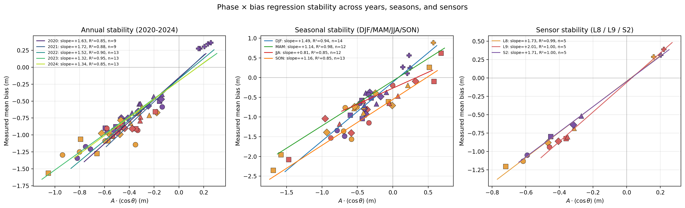

^1^ Department of Ocean Sciences, Inha University, Incheon 22212, Republic of Korea; ^2^ Haebom Data Inc., #904, Gasan A1 Tower, 205-27 Gasan 1-ro, Geumcheon-gu, Seoul 08503, Republic of Korea.  
\* Correspondence: tysong@haebomdata.com

This document accompanies the main manuscript and contains all
supplementary figures, the extended Table S1, and pointers to the
public derived-data tables that support the reported statistics.
Section, equation and figure numbers in the main manuscript are
referenced by their numerical labels without an "S" prefix; entries
in this document use the "S" prefix.

# Table S1 — Stability regression coefficients

Regression coefficients of the closed-form model
**mean bias = β · *A* · ⟨cos θ⟩** (Equation 1 of the main text) when the
15 (site × sensor) sample is repartitioned by acquisition year, season,
sensor, or via leave-one-site-out cross-validation. *n* is the number of
(site × sensor) points contributing to each fit. The pooled bootstrap
mean / 95 % CI is reported on the final row.

## Table S1a — Annual partition

| Year | n  | Intercept (m) | Slope β | r     | R²    | p-value | SE(β) | RMSE (m) | MAE (m) |
|:----:|:--:|:-------------:|:-------:|:-----:|:-----:|:-------:|:-----:|:--------:|:-------:|
| 2020 | 9  | −0.154        | 1.625   | 0.920 | 0.846 | 0.0004  | 0.262 | 0.177    | 0.139   |
| 2021 | 9  | −0.165        | 1.718   | 0.939 | 0.882 | 0.0002  | 0.238 | 0.118    | 0.100   |
| 2022 | 13 | −0.173        | 1.517   | 0.948 | 0.900 | <0.0001 | 0.153 | 0.126    | 0.105   |
| 2023 | 13 | −0.200        | 1.316   | 0.974 | 0.949 | <0.0001 | 0.092 | 0.103    | 0.084   |
| 2024 | 13 | −0.203        | 1.345   | 0.920 | 0.847 | <0.0001 | 0.173 | 0.131    | 0.102   |

## Table S1b — Seasonal partition (meteorological seasons, KST)

| Season | n  | Intercept (m) | Slope β | r     | R²    | p-value | SE(β) | RMSE (m) | MAE (m) |
|:------:|:--:|:-------------:|:-------:|:-----:|:-----:|:-------:|:-----:|:--------:|:-------:|
| DJF    | 14 | −0.116        | 1.491   | 0.971 | 0.943 | <0.0001 | 0.106 | 0.180    | 0.141   |
| MAM    | 12 | −0.084        | 1.138   | 0.992 | 0.984 | <0.0001 | 0.046 | 0.077    | 0.068   |
| JJA    | 12 | −0.269        | 0.809   | 0.919 | 0.845 | <0.0001 | 0.110 | 0.118    | 0.094   |
| SON    | 13 | −0.555        | 1.163   | 0.924 | 0.854 | <0.0001 | 0.145 | 0.245    | 0.188   |

## Table S1c — Per-sensor fit

| Sensor    | n | Intercept (m) | Slope β | r     | R²    | p-value | SE(β) | RMSE (m) | MAE (m) |
|:---------:|:-:|:-------------:|:-------:|:-----:|:-----:|:-------:|:-----:|:--------:|:-------:|
| Landsat 8 | 5 | −0.044        | 1.734   | 0.993 | 0.986 | 0.0007  | 0.121 | 0.065    | 0.057   |
| Landsat 9 | 5 | −0.063        | 2.007   | 0.998 | 0.996 | 0.0001  | 0.072 | 0.031    | 0.028   |
| Sentinel-2| 5 | −0.048        | 1.712   | 0.999 | 0.997 | <0.0001 | 0.053 | 0.025    | 0.020   |

## Table S1d — Pooled bootstrap (n = 15; 2 000 resamples, seed = 42)

| Parameter | Mean   | Median | 95 % CI low | 95 % CI high |
|:---------:|:------:|:------:|:-----------:|:------------:|
| Slope β   |  1.764 |  1.777 |    1.443    |    1.912     |
| Intercept (m) | −0.070 | −0.059 | −0.212 | −0.029     |

## Table S1e — Leave-one-site-out cross-validation (per-point residuals)

| Held-out site | Sensor | *A*·⟨cos θ⟩ (m) | Measured bias (m) | Predicted bias (m) | Residual (m) |
|:-------------:|:------:|:---------------:|:-----------------:|:------------------:|:------------:|
| Ganghwa-do    | L8     | −0.616          | −1.133            | −1.166             | +0.033       |
| Ganghwa-do    | L9     | −0.460          | −0.941            | −0.884             | −0.057       |
| Ganghwa-do    | S2     | −0.592          | −1.049            | −1.121             | +0.073       |
| Garorim Bay   | L8     | −0.720          | −1.205            | −1.377             | +0.172       |
| Garorim Bay   | L9     | −0.360          | −0.824            | −0.714             | −0.111       |
| Garorim Bay   | S2     | −0.452          | −0.798            | −0.884             | +0.085       |
| Gomso Bay     | L8     | −0.469          | −0.881            | −0.887             | +0.006       |
| Gomso Bay     | L9     | −0.406          | −0.860            | −0.775             | −0.085       |
| Gomso Bay     | S2     | −0.317          | −0.637            | −0.618             | −0.019       |
| Hampyeong Bay | L8     | −0.313          | −0.684            | −0.604             | −0.080       |
| Hampyeong Bay | L9     | −0.352          | −0.801            | −0.673             | −0.128       |
| Hampyeong Bay | S2     | −0.270          | −0.516            | −0.528             | +0.012       |
| Suncheon Bay  | L8     | +0.160          | +0.287            | −0.020             | +0.307       |
| Suncheon Bay  | L9     | +0.221          | +0.390            | +0.065             | +0.325       |
| Suncheon Bay  | S2     | +0.203          | +0.312            | +0.040             | +0.273       |

LOO summary: Pearson r = 0.969, RMSE = 0.156 m, MAE = 0.118 m;
sign-of-bias correct in 14 / 15 held-out points (the single miss is the smallest-magnitude Suncheon L8 point; see Table S1e).

---

# Table S2 — Robustness to amplitude definition and reference choice

Per-variant, per-sensor regression of the closed-form model
**mean bias = β · *A* · ⟨cos θ⟩** (main-text Equation 1) under the
four amplitude / reference combinations described in main-text §4.7:
(a) baseline (*A* = ½(HW−LW), KHOA hourly reference);
(b) *A* = strict M₂ amplitude from a 5-year `utide` decomposition,
KHOA observed reference;
(c) *A* = M₂ amplitude with the reference replaced by the
astronomical-only `utide.reconstruct` synthetic series;
(d) FES2022b global ocean tide model used as both reference and
satellite-overpass source, with *A* set to the site-specific mean
half-range computed from the FES synthesis.

## Table S2a — Pooled regression summary (n = 15)

| Variant | β     | 95 % CI       | Intercept (m) | R²    | LOO RMSE (m) | LOO Pearson r | Sign correct |
|:-------:|:-----:|:-------------:|:-------------:|:-----:|:------------:|:-------------:|:------------:|
| (a) Baseline KHOA            | 1.78 | [1.44, 1.92] | −0.057 | 0.980 | 0.16 | 0.969 | 14/15 |
| (b) M₂ amplitude + KHOA      | 1.87 | [1.50, 2.02] | −0.053 | 0.978 | 0.17 | 0.961 | 14/15 |
| (c) M₂ amplitude + astro. ref. | 1.90 | [1.49, 2.06] | −0.042 | 0.974 | 0.17 | 0.964 | 14/15 |
| (d) FES2022b global model    | 1.70 | [1.42, 1.80] | +0.004 | 0.983 | 0.11 | 0.977 | 15/15 |

## Table S2b — Per-sensor FES2022b values (variant d)

| Site         | Sensor | *n*  | *A* (m, FES) | ⟨cos θ⟩ | *A*·⟨cos θ⟩ (m) | KHOA bias (m) | FES bias (m) |
|:-------------|:------:|:----:|:------------:|:-------:|:---------------:|:-------------:|:------------:|
| Ganghwa-do   | L8 | 137 | 1.02 | −0.107 | −0.109 | −1.133 | −0.263 |
| Ganghwa-do   | L9 |  90 | 1.02 | −0.243 | −0.248 | −0.941 | −0.419 |
| Ganghwa-do   | S2 | 826 | 1.02 | −0.186 | −0.190 | −1.049 | −0.353 |
| Garorim Bay  | L8 | 129 | 2.16 | −0.143 | −0.309 | −1.205 | −0.632 |
| Garorim Bay  | L9 |  91 | 2.16 | −0.286 | −0.618 | −0.824 | −0.987 |
| Garorim Bay  | S2 |1656 | 2.16 | −0.213 | −0.461 | −0.798 | −0.784 |
| Gomso Bay    | L8 | 203 | 1.28 | −0.233 | −0.299 | −0.881 | −0.547 |
| Gomso Bay    | L9 | 110 | 1.28 | −0.257 | −0.330 | −0.860 | −0.562 |
| Gomso Bay    | S2 | 187 | 1.28 | −0.345 | −0.444 | −0.637 | −0.643 |
| Hampyeong Bay| L8 | 195 | 1.48 | −0.303 | −0.450 | −0.684 | −0.700 |
| Hampyeong Bay| L9 | 119 | 1.48 | −0.251 | −0.373 | −0.801 | −0.660 |
| Hampyeong Bay| S2 | 796 | 1.48 | −0.212 | −0.314 | −0.516 | −0.549 |
| Suncheon Bay | L8 |  70 | 1.00 | +0.303 | +0.302 | +0.287 | +0.523 |
| Suncheon Bay | L9 |  38 | 1.00 | +0.212 | +0.211 | +0.390 | +0.410 |
| Suncheon Bay | S2 | 435 | 1.00 | +0.148 | +0.148 | +0.312 | +0.317 |

The FES2022b *A* is the mean half-range of the synthesised 5-year
hourly series at each KHOA gauge coordinate, derived from the eight
major constituents (M₂, S₂, K₁, O₁, N₂, P₁, K₂, Q₁); the systematic
under-estimate at Ganghwa-do (FES 1.02 m versus KHOA 2.83 m for the M₂
component alone) reflects the inability of the 1/30° global grid to
resolve within-bay tidal amplification; consequently the FES variant
yields *lower-bound* bias magnitudes where the grid under-resolves the
local geometry, while still recovering the bias sign and functional form
— the basis for the gauge-free *a priori* application demonstrated in
main-text §4.8.

---

# Supplementary Figures

{width=90%}

{width=90%}

![Stability of the regression coefficients (companion to main-text Figure 5): (top row) slope β by year / season / sensor with ±1 SE error bars; (bottom row) R² by the same partitions. The horizontal red band marks the pooled (*n* = 15) bootstrap 95 % CI of β. All partitions yield β within or near the pooled CI and R² ≥ 0.85, indicating that the regression is robust to year, season, and sensor and is not driven by a single subset of the data; the underlying per-(site × sensor) scatter is shown in Figure S4 and the numerical values in Table S1.](figures/fig6_stability_coefficients.png){width=95%}

{width=95%}

{width=92%}

{width=95%}

{width=92%}

The four-variant robustness fit of Equation 1 of the main text (variants (a)–(d), including the FES2022b global-model variant) is summarised numerically in Table S2 above; a dedicated figure panel is omitted in this version because the per-variant β values, CIs, and LOO RMSEs are most compactly read from the table.
